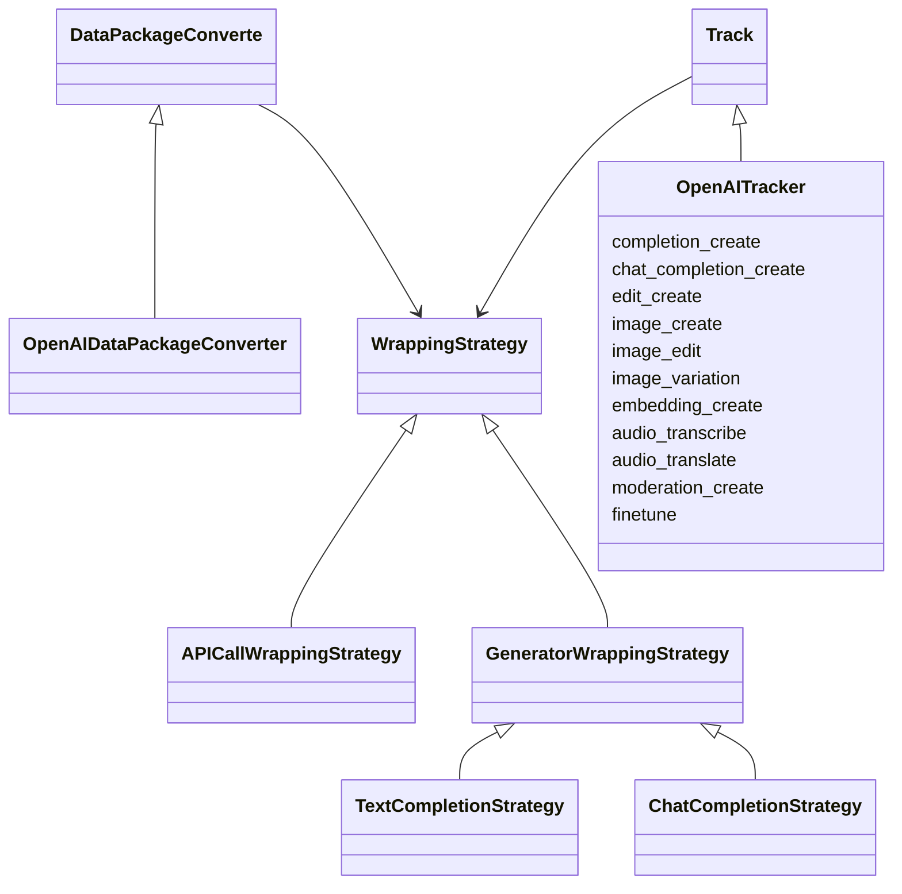
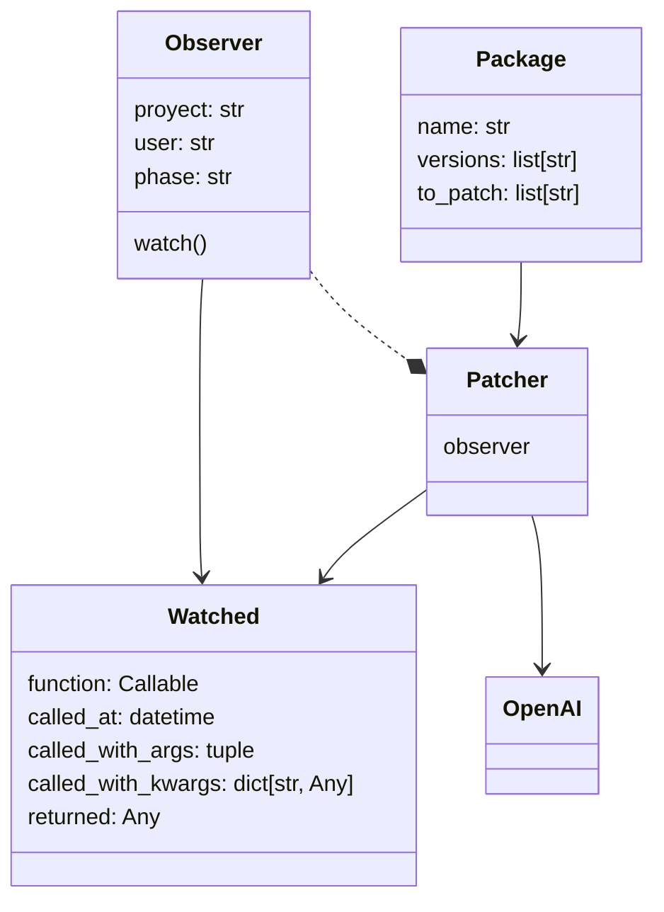

# Nebuly

## TODO

1. Thread for consuming events instead of calling requests from the thread that generated the event
2. Handle args and kwargs serialization - what happen if the args are not serializable?
3. Context manager for patching single portion of codes
   - nested context managers should have "stack" behaviour
4. Nice to have: semantic versioning expansion in package (maybe OSS library or Poetry?)

## Current state

### Issues

- Logic and configs are mixed
- Potentially lose information
    - When new api versions
    - When api changes
    - When a bug is present

## New state

### Advantages

- Every monkey patching is the same
- Easier to add more libraries and support different versions
- In case of a bug we don't lose any data, we can go back in time and reprocess

## TODO

Make sure we publish all these fields

- project name
- user
- provider
- library
- version
- args, kwars
- returned values
