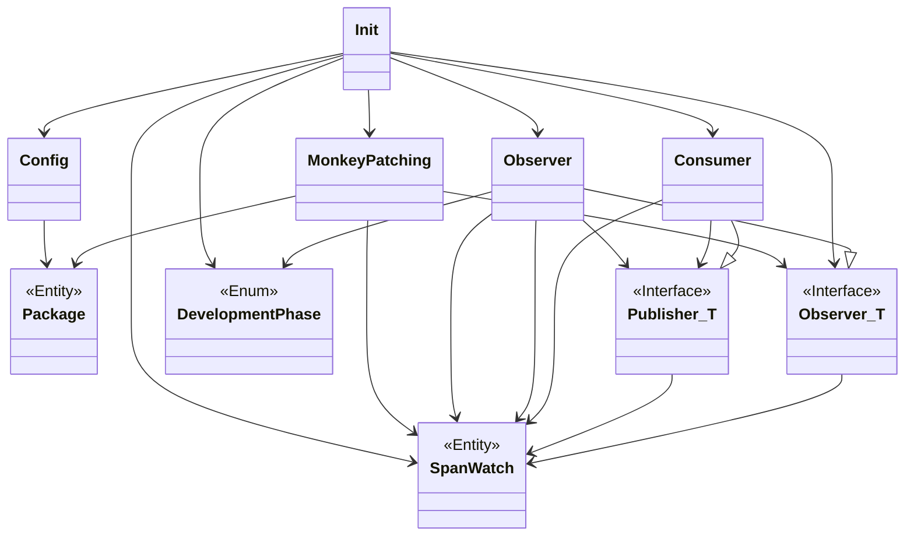

# Nebuly SDK

The SDK for instrumenting applications for tracking AI costs.

## TODO

1. Nice to have: semantic versioning expansion in package (maybe OSS library or Poetry?)
1. Check the publisher doens't crash, and if it does re start it somehow
1. batch processing
1. if publishing message fails retry (discuss how many retries before dropping the
   message)
1. limit queue size (discuss how long it should be and what to do if it gets full)

## Design



## Code Quality Checks

This section provides guidelines and instructions on how to perform code quality checks
using [**Black**](https://github.com/psf/black) as a formatter, [**Ruff
**](https://github.com/charliermarsh/ruff) as a linter, and [**SonarCloud
**](https://www.sonarsource.com/products/sonarcloud/) as a code quality checker. These
tools assist in ensuring that the codebase adheres to a consistent style, follows best
practices, and meets predefined quality standards.

### **Setup**

To set up the code quality checks for this project:

1. Clone the repository
1. Run the setup command to install the necessary requirements, including Poetry for
   handling dependencies

```
make setup
```

### **Code Formatting and Linting**

The code formatting and linting checks help maintain consistent style and identify
potential issues. Black and Ruff are automatically invoked with each commit, but they
can also be utilized independently without committing changes:

- To display the issues detected by the linter

```
make lint
```

- To automatically apply the formatter changes and the suggested changes by the linter,
  use the following command

```
make lint-fix
```

## Supported Providers

    - OpenAI
    - Azure OpenAI
    - Cohere
    - Anthropic
    - HuggingFace pipelines
    - HuggingFace HUB
    - LangChain
    - Amazon Bedrock
    - Amazon SageMaker
    - Google PALM API
    - Google VertexAI

## Usage

Make sure you initialize Nebuly before importing other libraries
like `openai`, `cohere`, `huggingface`, etc.

### Simple usage

In the simple case, you can just import nebuly and call the init function with your API
key. This will automatically
setup all the tracking for you. After that, you can call the other libraries as normal.

#### Example with OpenAI

```python
import os
import nebuly

api_key = os.getenv("NEBULY_API_KEY")
nebuly.init(api_key=api_key)

import openai

openai.api_key = os.getenv("OPENAI_API_KEY")
completion = openai.ChatCompletion.create(
    model="gpt-3.5-turbo",
    messages=[
        {"role": "user", "content": "Hello world"}
    ],
    user_id="test_user",
    user_group_profile="test_group",
)
```

#### Example with LangChain

```python
import os
import nebuly

api_key = os.getenv("NEBULY_API_KEY")
nebuly.init(api_key=api_key)

# Setup LangChain
from langchain.chains import LLMChain
from langchain.llms import OpenAI
from langchain.prompts import PromptTemplate

llm = OpenAI(temperature=0.9)
prompt = PromptTemplate(
    input_variables=["product"],
    template="What is a good name for a company that makes {product}?",
)

chain = LLMChain(llm=llm, prompt=prompt)
result = chain.run(
    "colorful socks",
    user_id="test_user",
    user_group_profile="test_group",
)
```

### Advanced usage: Context managers

In the simple case, each call will be stored as a separate Interaction, you can use
context managers to group
more calls in a single Interaction:

#### Example with OpenAI and Cohere

```python
import os
import nebuly
from nebuly.contextmanager import new_interaction

api_key = os.getenv("NEBULY_API_KEY")
nebuly.init(api_key=api_key)

# Setup OpenAI
import openai

openai.api_key = os.getenv("OPENAI_API_KEY")

# Setup Cohere
import cohere

co = cohere.Client(os.getenv("COHERE_API_KEY"))

with new_interaction(user_id="test_user", user_group_profile="test_group") as interaction:
    # interaction.set_input("Some custom input")
    # interaction.set_history([("system", "You are an helpful assistant"),])
    completion_1 = openai.ChatCompletion.create(
        model="gpt-3.5-turbo",
        messages=[
            {"role": "system", "content": "You are an helpful assistant"},
            {"role": "user", "content": "Hello world"}
        ]
    )
    completion_2 = co.generate(
        prompt='Please explain to me how LLMs work',
    )
    # interaction.set_output("Some custom output")
```

#### Example with LangChain

```python
import os
import nebuly
from nebuly.contextmanager import new_interaction

api_key = os.getenv("NEBULY_API_KEY")
nebuly.init(api_key=api_key)

# Setup LangChain
from langchain.chains import LLMChain
from langchain.llms import OpenAI
from langchain.prompts import PromptTemplate

llm = OpenAI(temperature=0.9)
prompt = PromptTemplate(
    input_variables=["product"],
    template="What is a good name for a company that makes {product}?",
)
chain = LLMChain(llm=llm, prompt=prompt)

with new_interaction(user_id="test_user", user_group_profile="test_group") as interaction:
    interaction.set_input("What is a good name for a company that makes colorful socks?")
    # interaction.set_history(...)
    result = chain.run("colorful socks")
    interaction.set_output("colorful socks spa")
```
