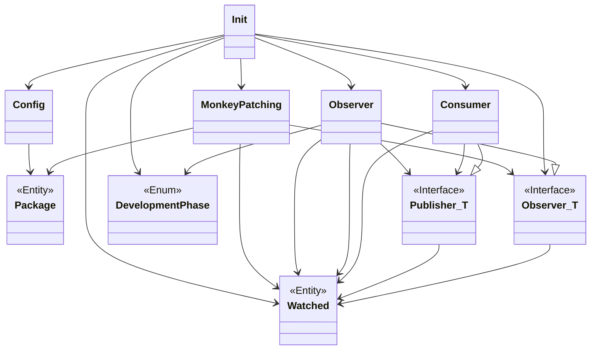

# Nebuly SDK
The SDK for instrumenting applications for tracking AI costs.

## TODO

1. Nice to have: semantic versioning expansion in package (maybe OSS library or Poetry?)
1. Check the publisher doens't crash, and if it does re start it somehow
1. batch processing

## Design



## Code Quality Checks
This section provides guidelines and instructions on how to perform code quality checks using [**Black**](https://github.com/psf/black) as a formatter, [**Ruff**](https://github.com/charliermarsh/ruff) as a linter, and [**SonarCloud**](https://www.sonarsource.com/products/sonarcloud/) as a code quality checker. These tools assist in ensuring that the codebase adheres to a consistent style, follows best practices, and meets predefined quality standards.

### **Setup**

To set up the code quality checks for this project:

1. Clone the repository
1. Run the setup command to install the necessary requirements, including Poetry for handling dependencies
```
make setup
```
### **Code Formatting and Linting**

The code formatting and linting checks help maintain consistent style and identify potential issues. Black and Ruff are automatically invoked with each commit, but they can also be utilized independently without committing changes:

- To display the issues detected by the linter
```
make lint
```
- To automatically apply the formatter changes and the suggested changes by the linter, use the following command
```
make lint-fix
```

## Supported Providers
    - OpenAI
    - Azure OpenAI

## Usage

Make sure you initialize Nebuly before importing other libraries like `openai`

```python
import os
import nebuly
...

if __name__ == "__main__":
    api_key = os.getenv("NEBULY_API_KEY")
    nebuly.init(api_key=api_key)
    ...
```
