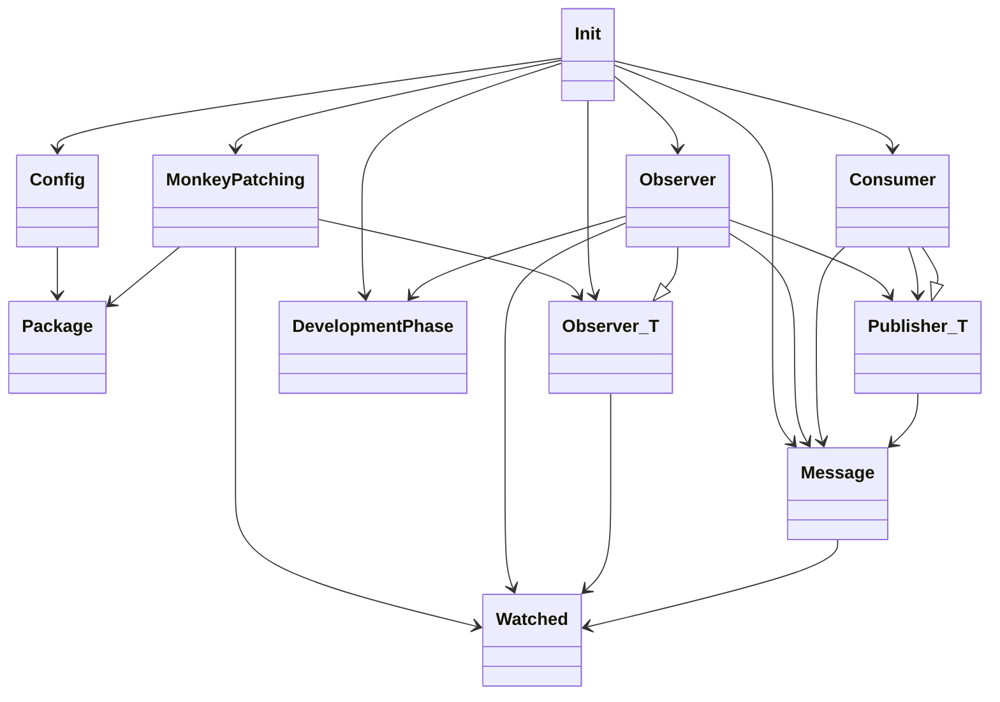

# Nebuly

## TODO

1. Nice to have: semantic versioning expansion in package (maybe OSS library or Poetry?)
1. Check the publisher doens't crash, and if it does re start it somehow
1. batch processing

## Design

