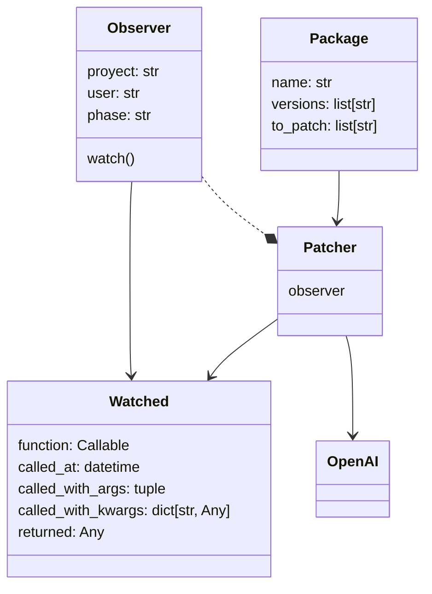

# Nebuly

## TODO

1. Nice to have: semantic versioning expansion in package (maybe OSS library or Poetry?)
1. Check the publisher doens't crash, and if it does re start it somehow
1. batch processing

Make sure we publish all these fields

- project name
- user
- provider
- library
- version
- args, kwars
- returned values

## Design

