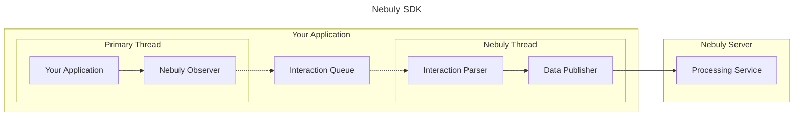

# Nebuly SDK Architecture
## Overview
The Nebuly SDK is a Python-based library, meticulously crafted to integrate
seamlessly into your application. It provides valuable insights into the
utilization of Language Learning Models (LLMs) such as OpenAI, Cohere, and
others. This document offers a comprehensive overview of the SDK's architecture
and its functionality within your application.

## Architecture Diagram

### Architecture Components
#### Your Application
This is the environment where the SDK is installed and operates. It integrates
into the primary thread of your application.

#### Nebuly Observer
The Observer is a component that monitors the calls to various LLM providers.
It gathers the input and output of these calls, collectively referred to as an
"interaction". An interaction may encompass multiple calls to the same or
different LLM providers, termed as "spans".

#### Interaction Queue
The Interaction Queue serves as a temporary storage for interactions. It
retains the interactions until they are ready for processing by the Interaction
Parser. This mechanism decouples the Primary Thread from the Nebuly Thread,
enabling concurrent operation.

#### Interaction Parser
The Interaction Parser is tasked with preparing the interactions for
transmission to the Nebuly Server. It operates on a separate Nebuly Thread,
ensuring that the primary application thread remains unblocked. The Parser is
equipped to capture input and output based on the specific LLM providers.

#### Data Publisher
The Data Publisher component transmits the parsed interactions to the Nebuly
Server. It ensures reliable and efficient data transmission.

#### Nebuly Server
The Nebuly Server is the destination where the interactions are received and
processed. It calculates various metrics such as user satisfaction, cost,
topic, frustration level, and latency.

## Performance Impact
The Nebuly SDK is engineered to have a minimal impact on your application's
performance. It operates on a separate thread, ensuring that your primary
application thread remains unblocked. In the event of any issues, the SDK is
capable of restarting its thread, ensuring uninterrupted operation.

## Error Handling
The SDK is designed to be robust and resilient to errors. It includes
try-except blocks to handle any potential issues and ensure smooth operation.
