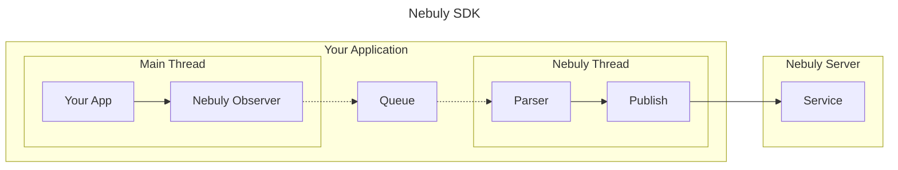

# Nebuly SDK Architecture

## Overview
The Nebuly SDK is a Python library designed to seamlessly integrate into your
application and provide valuable insights into the usage of Language Learning
Models (LLMs) like OpenAI, Cohere, etc. This document provides a high-level
overview of the SDK's architecture and its operation within your application.

## Architecture Diagram

### Architecture Components

#### Your Application
This is where the SDK is installed and operates. It integrates into the main
thread of your application.

#### Nebuly Observer
The Observer is the component that monitors the calls to different LLM
providers. It collects the input and output of these calls, which we refer to
as an "interaction". An interaction may contain more than one call to the same
or different LLM providers, these are called "spans".

#### Queue
The Queue is a temporary storage for the interactions. It holds the
interactions until they can be processed by the Parser. This decouples the Main
Thread from Nebuly Thread so both thread can work concurrently.

#### Parser
The Parser is responsible for preparing the interactions for transmission to
the Nebuly Server. It operates on a separate Nebuly Thread, ensuring that the
main application thread remains unblocked. The Parser knows how to capture
input and output depending on the different LLM providers.

#### Publish
The Publish component sends the parsed interactions to the Nebuly Server. It
ensures that the data is transmitted reliably and efficiently.

#### Nebuly Server
The Nebuly Server is where the interactions are received and processed. It
computes various metrics such as user satisfaction, cost, topic, frustration
level, and latency.

#### Performance Impact
The Nebuly SDK is designed to have minimal impact on your application's
performance. It operates on a separate thread, ensuring that your main
application thread remains unblocked. In case of any issues, the SDK is capable
of restarting its thread, ensuring uninterrupted operation.

#### Error Handling
The SDK is designed to be robust and error-proof. It includes try-except blocks
to handle any potential issues and ensure smooth operation.

# TODO

- Queue max size (for memory consumption) and what to do if reached? we drop oldest message? new messages?
- Batch publish
- Handle error (suggested by mick), and in case the publisher goes down restart it
